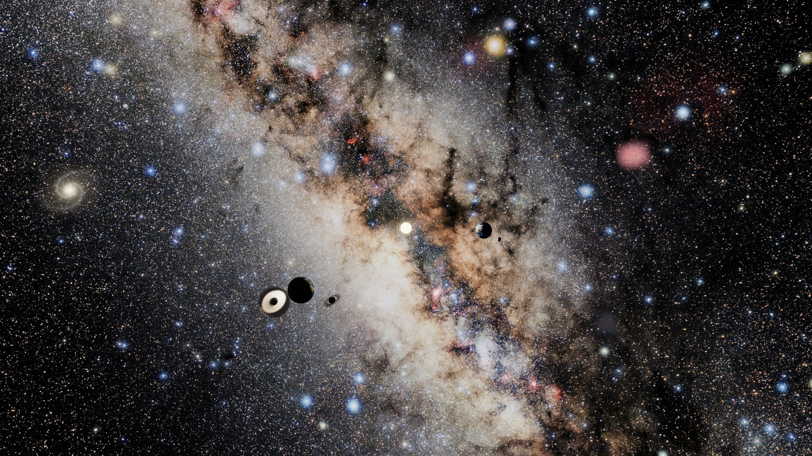
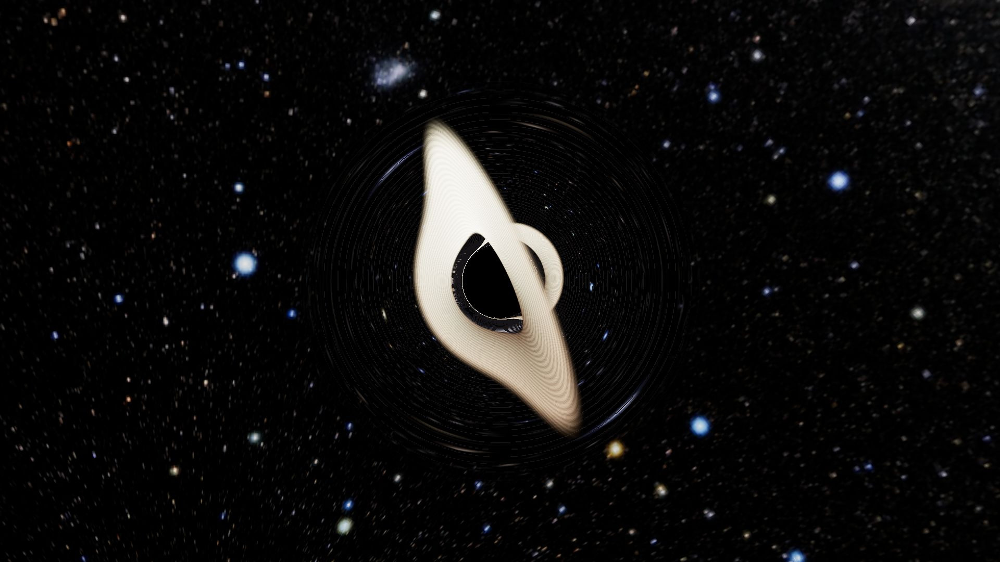

# Black hole and three-dimensional matter

The universe view contains no labels or visible controls. All objects share the main universe. The previous wormhole, throat, ray table and environment crossing have been removed.

## Explore

**B** or **6** approaches the original compact black hole. It follows Kepler X at a constant separation of 28 scene units in an inclined orbit with a rotated ascending node. Its shadow remains 1.05 units in radius. The accretion disk slowly precesses and tilts through diagonal orientations; drag allows unrestricted camera rotation.

Click the spiral galaxy, ionized nebula or molecular cloud, or press **G**, **N** or **C**. They occupy separate distant directions, more than 900 scene units beyond the planetary cluster. They remain real three-dimensional fields rather than photographs or replacement planets. Approaches stop at approximately 4.8 bounding radii, farther away on portrait screens, with no free translation or zoom into expensive interiors. Right-click or Escape returns to the planetary overview. Number keys 1–5 retain the planet and Hubble controls.

## Schwarzschild optics

Lengths use the Schwarzschild radius `r_s = 2GM/c²`. The event horizon is `r_s`, the photon orbit `1.5 r_s`, the critical shadow impact parameter `sqrt(27)/2 r_s`, and the disk begins outside the ISCO at `3 r_s`.

Backward rays use the spatial null-orbit acceleration `p'' = -1.5 b² p/r⁵`. The local observer angle supplies the conserved impact parameter. The GPU uses bounded affine integration and tests disk-plane intersections, capture at the horizon, and planetary spheres along the exiting ray. Exiting rays sample the resident photographic sky and world-space galaxy/cloud densities, using the same full photographic textures as the main scene without duplicate image allocations.

The thin disk has an inner-boundary temperature profile, local circular velocity, gravitational redshift and Doppler beaming. RGB thermal colors, exposure, a finite integration region and reduced samples approximate broadband optical light. This does not solve calibrated spectra, magnetohydrodynamics or Kerr frame dragging. The prescribed disk precession is a visual orientation model, not a calculated relativistic torque; the Schwarzschild metric itself is spherically symmetric and nonrotating. The orbit, object masses, sizes and distances are illustrative rather than a self-consistent N-body system.

The CPU reference checks analytical shadow capture, numerical convergence and conserved null-orbit energy. Visual references: [NASA's accretion-disk visualization](https://svs.gsfc.nasa.gov/14619/) and [James et al., black-hole lensing](https://arxiv.org/abs/1502.03808).

## Three-dimensional matter

The spiral contains an exponential stellar disk, central bulge, logarithmic spiral density enhancements, young stellar emission, gas regions and offset turbulent dust lanes. Its 90,000 individual stars occupy real 3D positions. Clouds use turbulent density and cavities. Finite world-space bounds produce changing projection, depth and parallax when the camera moves or rotates. The galaxy is static over this short observing interval; scrolling does not spin it like a planet.

Worker-generated RGBA8 Data3DTextures store square-root encoded stellar, young-star, gas and dust densities. Sampling decodes them before integration. Emission approximates stellar continuum, H-alpha and OIII gas emission; dust extinction increases toward blue. Bounded ray marching integrates emission and absorption using [Beer-Lambert transmittance](https://pbr-book.org/4ed/Volume_Scattering/Transmittance). Embedded stars receive colored dust attenuation. Premultiplied compositing retains emission even when absorption is nearly zero. Background transmission uses a scalar approximation from the colored extinction channels. Multiple scattering, calibrated spectra, hydrodynamic evolution and cosmological expansion are not solved.

These are physically motivated numerical realizations, not measured astronomical objects. Densities, exposure and positions are normalized for viewing.

## IllustrisTNG research

The [TNG specifications](https://www.tng-project.org/data/docs/specifications/) describe gas-cell positions, densities, temperatures, stellar populations and black-hole quantities. The [API](https://www.tng-project.org/data/docs/api/) supports selected-field cutouts. These could supply the density-field interface, but authenticated data needs a TNG account/API key and full snapshots exceed the browser's budget. No downloaded TNG galaxy or API key is bundled; the field categories informed the original numerical models.

## Memory and performance

The adaptive optimizer remains active in highest mode. There is one complete environment, no retained portal copies and no crossing allocations. Planet, sky, spacecraft, black-hole and music updates continue while observing any volume.

Density bricks stream serially according to visibility, projected size, GPU limits and estimated memory headroom. Offscreen fields shrink to 48³; distant visible fields use 64³, ordinary visits use 128³, and sufficiently prominent fields can use 256³. The modeled stellar population is also culled outside the camera frustum. A 256³ brick costs about 73 MiB on GPU including mipmaps plus 64 MiB retained for context restoration. Replacement checks include the old/new coexistence peak, and reductions proceed even when current allocations already exceed the lowered budget. Cancelled workers cannot bind stale results.

Only static volume radiance is cached at the current camera view. Movement immediately renders fresh world-space integrals with 48 depth samples. After 160 ms of stillness, interleaved native-pixel batches refine the image with up to 192 samples. Camera, projection or density-texture changes invalidate the cache. At 1920 × 1080 its RGBA16F target costs about 16 MiB. Moving planets and the black hole are rendered afresh and mask cached volume light where they lie in front; the entire scene is never frozen. Silhouettes use analytic spherical bounds, with a conservative bound around the black-hole lensing region.

The browser exposes approximate RAM hints and allocation estimates, not free VRAM. Highest mode retains HD output within GPU/allocation bounds while adapting textures and secondary effects. Actual frame rate also depends on the browser GPU backend and tab visibility. [Current verification](validation.md) records the tested limits.
