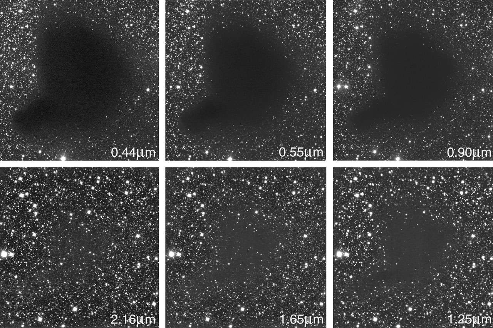
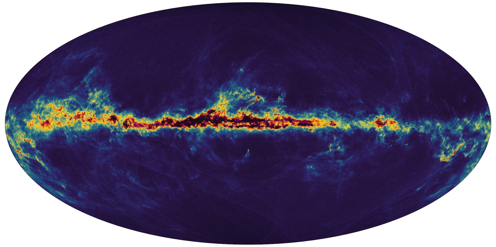

# Photographic stars, dust, and apparent color

## What the observations show

The 3D scene uses the [NOIRLab all-sky photograph](https://noirlab.edu/public/images/noirlab2430b/), credited to NOIRLab/NSF/AURA/E. Slawik/M. Zamani. The original is 40000 × 20000 pixels. The supplied 16K and 8K versions are Lanczos3 resamples with quality-96, 4:4:4 JPEG encoding. Their stars, dust lanes, and base colors are photographed content, with no generated sky or added point/sprite objects.



**ESO, Barnard 68 in six wavebands.** Compare the same field at 0.44 and 0.55 micrometres at the top left/middle with 1.25, 1.65, and 2.16 micrometres at the bottom. The dark region obscures visible light much more strongly; longer wavelengths reveal many background stars. This comparison supports wavelength-dependent dust extinction, rather than dust making arbitrary new colors. These are observations at different wavelengths, **not successive frames showing the dust moving**. [Original image and explanation](https://www.eso.org/public/images/eso9934b/). Credit: ESO; [CC BY 4.0](https://www.eso.org/public/outreach/copyright/).



**Gaia's inferred interstellar-dust map.** It shows how obscuration is distributed, especially along the Galactic plane. This is a scientific map with a descriptive color scale, **not a true-color sky photograph**. Its map colors must not be pasted into the scene as apparent stellar colors. [Original map and explanation](https://www.esa.int/ESA_Multimedia/Images/2022/06/Gaia_map_of_interstellar_dust_in_the_Milky_Way). Credit: ESA/Gaia/DPAC; T. E. Dharmawardena, Gaia group at MPIA; CC BY-SA 3.0 IGO. The downloaded map is unmodified.

## Three separate mechanisms

| Mechanism                 | What changes                                                                                              | Treatment here                                                                                    |
| ------------------------- | --------------------------------------------------------------------------------------------------------- | ------------------------------------------------------------------------------------------------- |
| Stellar spectrum          | Intrinsic color depends on the star's emitted spectrum                                                    | Preserve the photograph's measured/photographically processed base colors                         |
| Interstellar extinction   | Dust removes/scatters light, generally blue more strongly than red                                        | Preserve the dust already captured in the photograph; do not add a rapidly moving procedural veil |
| Atmospheric scintillation | Turbulent air changes the received light from an unresolved star; apparent brightness/color can fluctuate | Optional subtle night-sky observing effect on existing photographic light regions                 |

[ESO explains](https://www.eso.org/public/teles-instr/technology/adaptive_optics/) that atmospheric turbulence causes twinkling and that observing from space avoids this atmospheric distortion. [ESA's interstellar-medium reference](https://cesar.esa.int/upload/201801/ism_booklet.pdf) explains extinction and reddening. A photograph alone cannot establish the timing or amplitude of a particular star's variation. No real-time measurements of these stars or dust motions are included.

## Applying the pixel-color idea

Multiplying pixels is a useful rendering technique, but independent random RGB values per frame make digital noise rather than an astronomical mechanism. A dust transmission model would use, in linear light:

```text
observed RGB = incident RGB × exp(-optical-depth RGB)
```

Optical depth must stay nonnegative, and ordinary visible dust attenuation removes more blue than red. Dust already recorded in this photo must not be counted a second time. Therefore the former moving density volume has been removed from the runtime.

For the requested visible night-sky feeling, the default instead uses a **bounded atmospheric observing approximation**. A response map is calculated from isolated bright regions of the actual photograph. Smooth brightness and warm/cool gains modulate the original linear RGB values. There is no UV displacement, no new emitted star light independent of the photograph, no changing random seed every frame, and no blanket tint of diffuse Milky Way dust. The same small region shares a phase so a photographed star varies coherently instead of dissolving into pixel grain.

The response map uses a blurred copy only for offline local-contrast analysis; **the displayed photograph is never blurred**. Its red channel stores modulation strength, and the other channels store deterministic phase/frequency values. Source metadata accompanies the map. Multiplication preserves a black source pixel as black and cannot create a new star location.

**Press T outside music mode** to disable the observing treatment and see the steady photographic space view. Shimmer is enabled initially to match the requested animated sky. It is an aesthetic approximation of looking through Earth's atmosphere, not a claim that a camera in vacuum experiences the same flicker. Point at empty sky and scroll to control its independent animation clock, without altering any planetary or spacecraft motion.

## Scope of the orbital scene

Earth, Luna, and Hubble have real imagery/models. Kepler X and its ringed moon are fictional, and the orbital arrangement uses prescribed paths and illustrative sizes/distances. This is a photorealistic visual explorer with several physical lighting approximations, rather than a validated N-body or spectroscopic simulation. Camera navigation, ring shadows, eclipses, and music behavior are documented separately in [the implementation reference](architecture.md).
