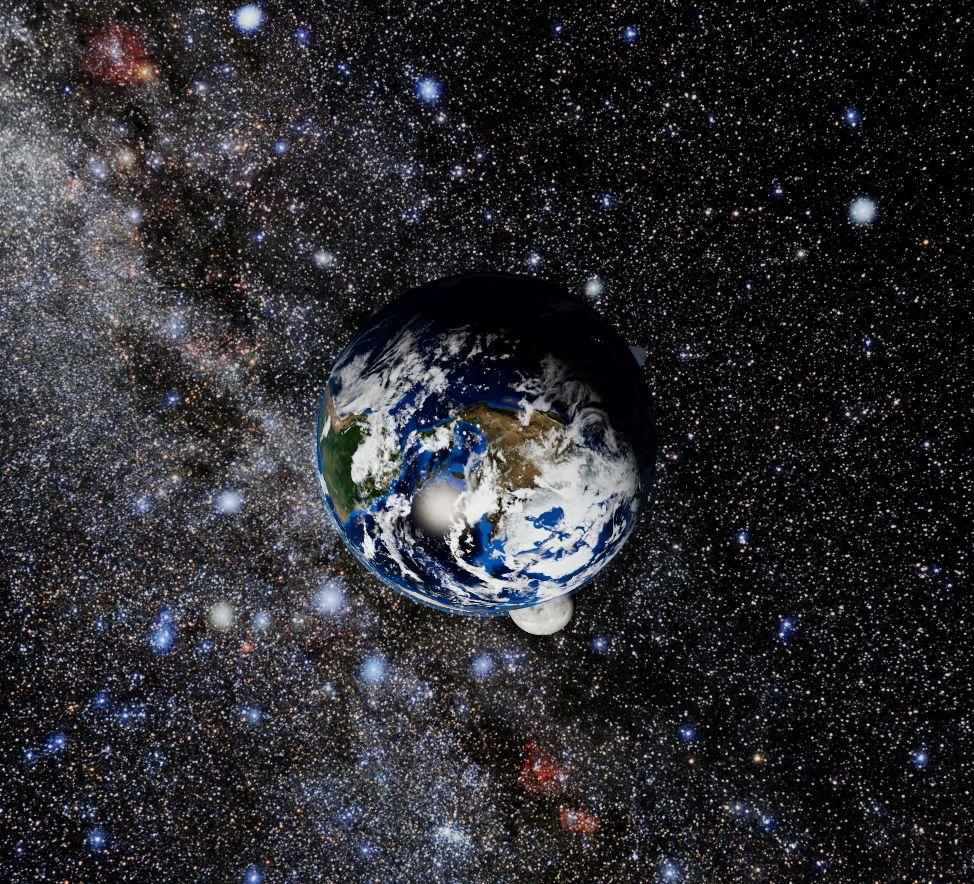
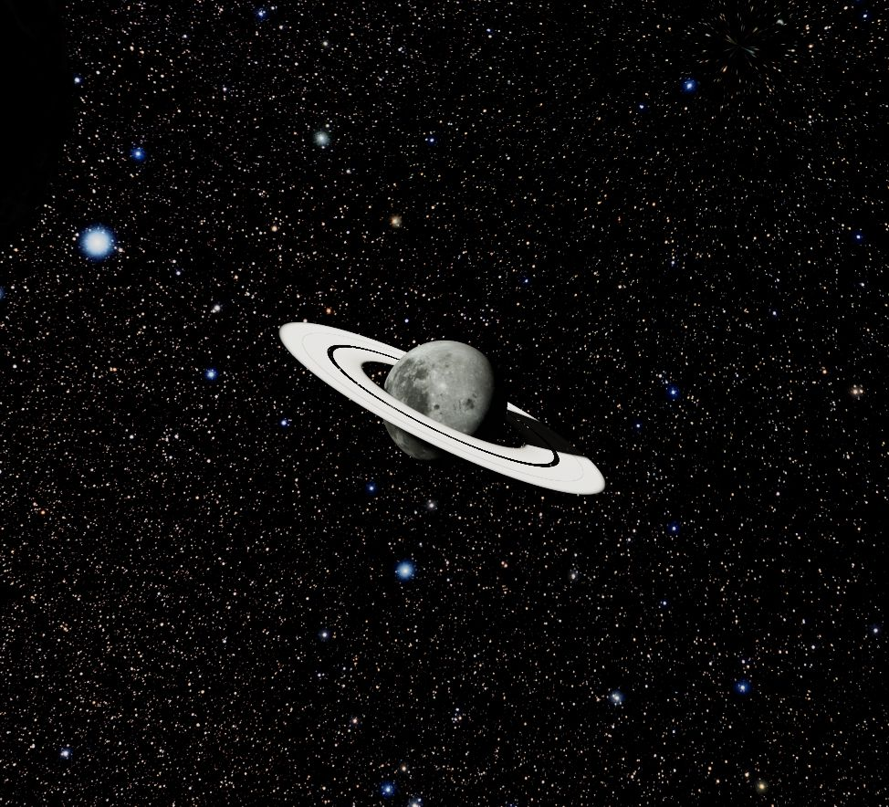
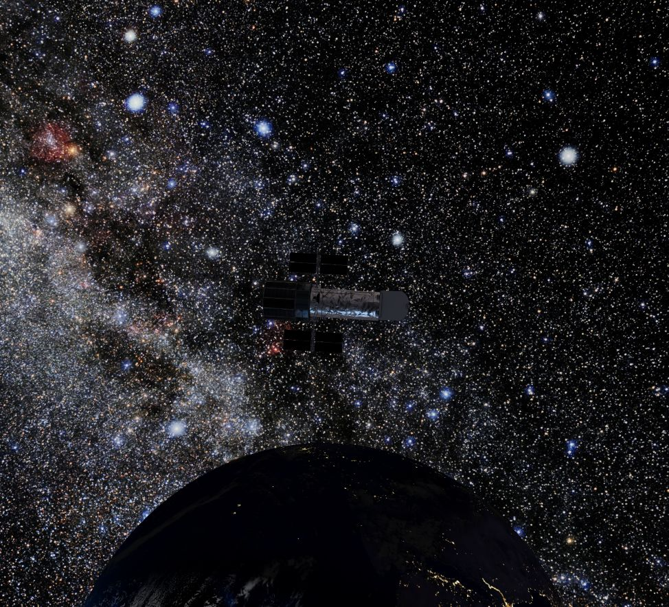

# PLansi_xi — first visit

## 1. Open the system

For an online visit, open **[o0space0o.app](https://o0space0o.app/)** and allow the high-resolution textures to load. The controls below apply to the live preview too. To play your own songs from **Audio/**, use the local version:

Download or clone the complete [PLansi_xi repository](https://github.com/o0space0o/PLansi_xi). On Windows, double-click **Start PLansi_xi.cmd**. Keep the terminal open and allow the high-resolution textures to load. The website opens at <http://127.0.0.1:4173> with the whole system in view. No visible panels or labels appear.

On macOS/Linux, install Node.js 24 or newer and run `node scripts/serve.mjs`. **Guide.html** opens offline if you want to read instructions before starting.

## 2. Visit Earth

Press **1**, or left-click Earth. The camera takes a continuous route toward it, then follows its orbit. Left-drag to inspect the surface from another angle. You can keep rotating through complete turns in any direction.

Right-click to fly back. The number keys provide easy first-visit shortcuts when a moon or Hubble looks small in the overview: **2** Luna, **3** Kepler X, **4** Aurelia, **5** Hubble.

## 3. Change only the motion you point at

Point at Earth's visible surface and scroll **up**. Earth's orbit, surface rotation, and clouds accelerate. The other clocks stay unchanged. Scroll **down** repeatedly to slow or pause Earth; scroll up to resume.

Now point at empty sky and scroll. This changes the speed of the photographic background shimmer independently. **T** switches it off/on. Pausing a moon stops its orbit around its parent, while its parent can still carry it through the system. Reload the page whenever you want all speeds reset to 1×.

The wheel controls animation rather than zoom. Camera flight duration stays constant. The [complete controls reference](website-guide.md) explains target selection and the 80× speed limit.

## 4. Inspect the ringed moon

Press **4** to visit Aurelia. Its rings have visible bands, gaps, and shadows on the moon. Scrolling over either the moon or its rings changes Aurelia's motion. It is an imagined moon, using lunar terrain as artwork.

## 5. Listen from Hubble

Press **5** to visit NASA's Hubble model. Press the **middle wheel button** once (or **M**) to enter hidden music mode. Short-left-click to play. Scroll to change volume. Short-right-click to stop and rewind.

Hold left for **650 ms** to select the next song; hold right to select the previous song. Middle-click again to leave the mode. Playback continues and the normal camera controls return. The camera is the listener, so the direction of Hubble and intervening worlds affect the cinematic radio sound. Try headphones.

The GitHub download has **no songs**. Put your own files directly in **Audio/** and re-enter music mode to discover them. A file named `Words before sleep` is prioritized when present; other supported filenames follow in order. Songs are ignored by Git and stay local. [Full music-player instructions](music-player.md) include keyboard alternatives, formats, and troubleshooting.

## 6. Keep the best image

Highest available graphics are selected by default. The real sky panorama is **16K**, cloud/night maps are **8K**, and rendering uses native display density with multisample antialiasing. Quality does not decrease automatically when frame rate drops.

For a smaller computer, deliberately select <http://127.0.0.1:4173/?quality=8k>. This reduces sky/cloud/night asset sizes. Enable browser hardware acceleration if you see a black screen. The photographic sky has no invented star particles; [stars and dust](starlight-science.md) explains the optional observing effect and the limits of the visual simulation.

Press **H** for the guide, **Escape** or right-click for the system, and **Ctrl+C in the terminal** when finished. When sharing the project, keep the complete repository folder together.
