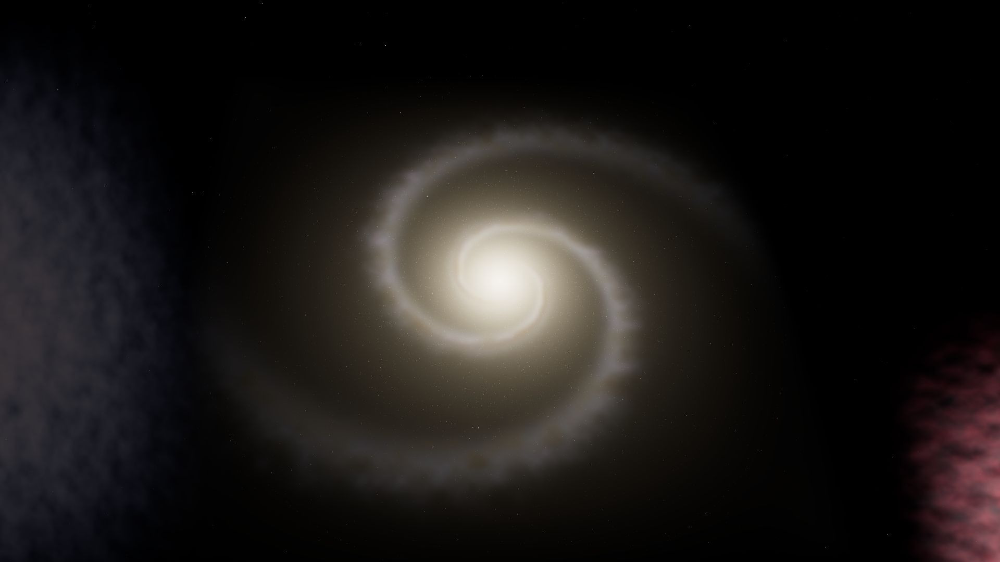
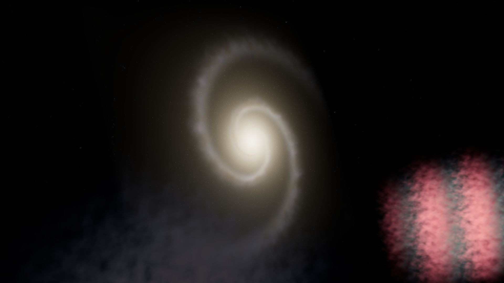

# Black hole, curved-space travel and volume rendering

The universe view contains no labels, buttons, captions or credits. Instructions and scientific assumptions live here, outside the scene.

## Explore

The black hole is 28 scene units from Kepler X, compared with the previous 11. Its shadow remains 1.05 units in radius. **B** approaches it. The adjacent Ellis throat is a separate object, 9 units away: **W** approaches it, **Enter** or another click crosses it. A Schwarzschild horizon is not used as a traversable passage.

After arrival, click the spiral galaxy, ionized nebula or molecular cloud; **1–3** do the same. Camera approaches stay outside their dense volumes, at about 2.7 bounding radii. Drag rotates, with no free translation or zoom into arbitrarily expensive regions. Right-click/Escape returns to the overview. **B/W**, then **Enter**, returns through the throat. No invented gas planets or galaxy/nebula photographs are rendered.






## Schwarzschild optics

For the nonrotating model, lengths use the Schwarzschild radius `r_s = 2GM/c²`. The event horizon is `r_s`, the photon orbit `1.5 r_s`, the critical shadow impact parameter `sqrt(27)/2 r_s`, and the disk begins outside the ISCO at `3 r_s`.

Backward rays use the spatial null-orbit acceleration `p'' = -1.5 b² p/r⁵`. The local observer angle supplies the conserved impact parameter. The GPU uses bounded affine integration and tests disk-plane intersections, capture at the horizon, and the actual planetary spheres along the exiting ray. The thin disk has an inner-boundary temperature profile, local circular velocity, gravitational redshift and Doppler beaming. RGB thermal colors and exposure approximate broadband optical light, rather than solving a full spectrum or magnetohydrodynamics. Weak deflection outside the integration sphere and small high-order images are approximate at reduced ray budgets.

The CPU reference verifies capture on both sides of the analytical shadow threshold, numerical convergence and the conserved null-orbit energy. Visual references: [NASA's black-hole accretion disk](https://svs.gsfc.nasa.gov/14619/), [James et al.](https://arxiv.org/abs/1502.03808).

## Ellis crossing

The traversable model is the hypothetical Ellis metric described by [James, von Tunzelmann, Franklin and Thorne](https://arxiv.org/html/1502.03809v3):

```text
ds² = -dt² + dl² + (a²+l²) dΩ²
dl/dλ = p_l
dp_l/dλ = b² l/(a²+l²)²
dφ/dλ = b/(a²+l²)
p_l² + b²/(a²+l²) = 1
```

The camera travels continuously in proper radial distance `l`, through `l=0`, with a transported viewing frame. A 1024 × 193 float ray table is generated from RK4 integration of these equations, with logarithmic radial sampling and cos/sin storage. The shader interpolates the ray direction and classifies its outgoing chart analytically. Rays then intersect world-space matter on the appropriate side. It never samples or warps an existing framebuffer. The forward destination becomes visible before crossing; loading can pause the camera at the throat while both bounded boundary representations remain renderable. The observer's normalized time uses 200 units of `a/c` per display second, keeping the crossing below 0.04c. Local aberration and Doppler specific-intensity beaming follow the Lorentz transform; RGB spectral colors remain approximate.

For finite real-time work, the metric is joined to a Euclidean exterior at `16a`, and the ray table covers camera distances to `64a`. Critical rays around `b=a`, small caustics and far-field deflection are finite-resolution approximations. The reference tests compare against four-times-finer integration away from caustics and verify chart symmetry and energy conservation. This is a defined optical model, not evidence that traversable wormholes exist. It requires hypothetical exotic matter; the scene does not solve Einstein's equations for a combined black-hole/wormhole system.

## Three-dimensional matter

The spiral has an exponential stellar disk, a central bulge, logarithmic spiral density enhancements, young stellar emission, gas regions and offset turbulent dust lanes. Stars occupy real 3D positions. Clouds use 3D turbulent density and cavities. These fields have finite world-space bounds and change projection, occlusion and parallax when the camera moves or rotates.

Worker-generated RGBA8 Data3DTextures store square-root encoded stellar, young-star, gas and dust densities. Sampling decodes the fields before integration. Visible emission approximates stellar continuum, H-alpha and OIII gas emission; dust extinction increases toward blue. Bounded ray marching integrates emission and absorption using the [Beer-Lambert transmittance equation](https://pbr-book.org/4ed/Volume_Scattering/Transmittance). Premultiplied compositing retains light even when absorption is nearly zero. Embedded stars receive colored dust attenuation along their view rays. Multiple scattering, calibrated spectra, hydrodynamic evolution and cosmological expansion are not solved.

The models are physically motivated realizations, not measured astronomical objects or a live N-body simulation. Densities, exposure, distances and existing planet/orbit scales are normalized for viewing; they do not establish a single calibrated astrophysical mass/distance system. The galaxy is static over this short observing interval; scrolling does not spin it like a planet.

## IllustrisTNG research

The [TNG specifications](https://www.tng-project.org/data/docs/specifications/) describe gas-cell positions, density, temperatures, stellar populations and black-hole quantities. The [API](https://www.tng-project.org/data/docs/api/) supports small selected-field cutouts. These are appropriate future inputs to the density-field interface, but authenticated cutouts require a TNG account/API key. No key is included or requested while the user is away. Full snapshots are far too large for this browser. This implementation uses the documented physical field categories as research, and does not claim to render a downloaded TNG galaxy.

## Memory and performance

Only one complete environment owns the large assets. At `l=0`, pending texture/volume jobs are cancelled, the source scene's geometry, materials, shadow targets, PMREM, GPU textures and decoded ImageBitmaps are released, and density fields shrink to boundary resolution. The destination then loads. A failed load releases partial resources and rebuilds the origin, moving the camera back through proper distance. Clocks and animation rates are numeric state; inactive orbital clocks pause. Music pauses without losing the local playback position.

Three 48³ density bricks, reduced home maps and the ray table form a small retained boundary representation. Large volume bricks stream serially according to visibility and projected size. Highest mode can refine a prominent brick to 256³: about 73 MiB on GPU including 3D mipmaps, plus 64 MiB retained for context restoration. The estimate includes pending worker output, CPU/GPU buffers, stars, texture replacement peaks and render targets. Worker termination and generation tokens prevent stale results from reviving disposed resources.

The destination's static matter permits a camera-dependent HDR radiance cache. During navigation, the current camera renders live geometry and a bounded volume integration with filtered density samples. After 160 ms without movement, interleaved pixel batches recompute the volume integral at full spatial detail and up to 192 depth samples. At 1920 × 1080, 64 batches spread refinement over approximately a second at 60 FPS. Every refined pixel comes from the actual 3D scene. Camera, projection or density changes invalidate the frame immediately; unloading releases its target. This avoids repeating an identical expensive integral while preserving native HD detail after refinement. The cache needs about 16 MiB at full HD. The wormhole crossing always uses its metric renderer, rather than this cached image.

`?quality=highest` starts with the highest detail and keeps the memory optimizer active. It preserves HD output within GPU/allocation bounds and high spatial density detail while first varying integration samples, MSAA, bloom, shadows and texture work. GPU queries are asynchronous; frame pacing is distinguished from expensive rendering. Automatic mode can also reduce render resolution. Actual free GPU memory is not exposed by browsers, so the budget is conservative. 60 FPS is a target, including on Edge; software WARP rendering cannot provide the same performance as hardware acceleration.

Regenerate the numerical ray table with `node scripts/prepare-wormhole.mjs`. `npm test` covers metric convergence, table consistency, transfer invariance, resource disposal, cancellation and adaptive policy. Read-only WebMCP diagnostics report actual volume dimensions, residency, texture counts, memory estimates, HD render ratio and CPU/GPU timings without adding labels to the view.
